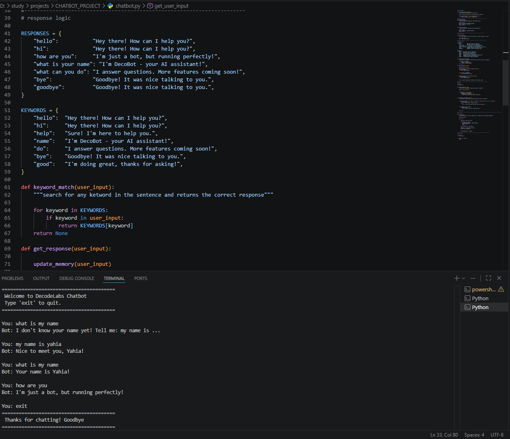

# Rule-Based AI Chatbot 🤖

> Project 1 — DecodeLabs Industrial Training | Batch 2026

A rule-based AI chatbot built with pure Python — no ML libraries needed.
Demonstrates control flow, decision-making logic, and foundational AI concepts.

---

## Features

- Exact match responses using Dictionary (O(1) lookup)
- Keyword matching for natural sentence understanding
- Simple memory (remembers user name across session)
- Conversation history saved to `history.txt`
- Clean modular code structure
- Input sanitization (lowercase + strip)

---

## Project Structure

```
CHATBOT_PROJECT/
├── chatbot.py        # Main chatbot file
├── history.txt       # Auto-generated conversation logs
├── requirements.txt  # Dependencies
├── .gitignore        # Files to ignore in Git
└── README.md         # Project documentation
```

---

## How to Run

```bash
# 1. Clone the repo
git clone https://github.com/your-username/chatbot-project.git

# 2. Navigate to project folder
cd chatbot-project

# 3. Run the chatbot
python chatbot.py
```

---

## Example Conversation

```
========================================
   Welcome to DecodeLabs Chatbot!
   Type 'exit' to quit.
========================================

You: hello
Bot: Hey there! How can I help you?

You: my name is Yaya
Bot: Nice to meet you, Yaya!

You: what is my name
Bot: Your name is Yaya!

You: can you help me
Bot: Sure! I'm here to help you.

You: exit
========================================
   Thanks for chatting! Goodbye!
========================================
```
---
## Results Screenshot




---

## Concepts Covered

| Concept | Implementation |
|---|---|
| Control Flow | if / elif / else |
| Data Structures | Dictionary (O(1) lookup) |
| Functions | Modular clean structure |
| Loops | while True + break |
| String Handling | lower() + strip() + split() |
| File I/O | Save conversation to .txt |
| Memory | Session state with dictionary |

---

## How This Relates to Real AI

```
This Project          →   Real AI Systems
─────────────────────────────────────────
RESPONSES dict        →   Knowledge Base
keyword_match()       →   Intent Detection
memory{}              →   Session State
history.txt           →   Conversation Logs
```

---

## Author

**Yaya** — NLP Engineer & AI Graduate
Faculty of Artificial Intelligence, Kafr El-Sheikh University (2023)

---

## License

MIT License
